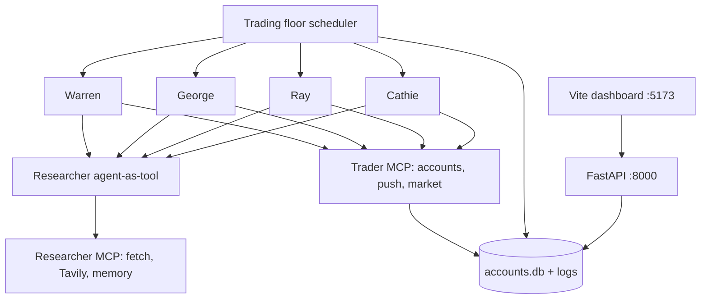

# Autonomous Traders

Four named traders (Warren, George, Ray, Cathie) plus a nested **researcher** agent. They use **MCP** servers for accounts, push notifications, market data, web search, fetch, and memory. A FastAPI backend and a Vite dashboard show portfolios and live traces.

Built on [Ed Donner’s Agents course](https://github.com/ed-donner/agents) Week 6. Local market data uses **previous close** on a free Massive key (last-trade is paid). MCP servers merge the full process `PATH` so `uv` / `npx` actually start.

**Not financial advice. Do not trade real money with this.**

## What I tried to learn

I used this project to practice **agentic systems that act through tools**, not a single chat completion.

| Idea | How it shows up here |
|---|---|
| **MCP** | Tools live in separate stdio processes. The agent runtime discovers and calls them. |
| **Agent-as-tool** | Each trader wraps a researcher agent (`as_tool`) instead of stuffing search into the trader prompt. |
| **Resources vs tools** | Account snapshot and strategy are read as MCP **resources**; buys/sells are **tools**. |
| **Scheduler** | `trading_floor.py` runs the four traders on a timer; skip when the US market is closed unless you override. |
| **Multi-model** | Default is one OpenAI model. `USE_MANY_MODELS=true` can split traders across GPT / DeepSeek / Gemini / Grok. |
| **Observability** | OpenAI Agents SDK traces and spans are written to SQLite and shown on the dashboard. |

Interview briefing (ADK, no MCP) lives in the sister repo [interview-prep](https://github.com/saaragmon/interview-prep).

## The architecture



**Layers**

1. **Engine** — `backend/trading_floor.py` creates four `Trader` instances and `asyncio.gather`s a run. Each run alternates **trade** vs **rebalance**.
2. **Agents** — OpenAI Agents SDK `Agent` + `Runner.run` (max 30 turns). Trader instructions come from `backend/templates.py`.
3. **MCP** — stdio servers started per run (`MCPServerStdio`). Trader vs researcher get **different** server lists.
4. **State** — SQLite `accounts.db` (balances, holdings, log lines). FastAPI is **read-only**; only the floor writes.
5. **UI** — Vite + TypeScript polls the API for roster, heatmap, charts, and colored log spans. Gradio (`app.py`) is an alternative in-process dashboard.

## MCP

[Model Context Protocol](https://modelcontextprotocol.io/) is how tools are exposed without baking APIs into the agent class.

**Trader servers** (`trader_mcp_servers`)

| Server | Process | Role |
|---|---|---|
| `accounts` | `uv run -m backend.accounts_server` | Positions, buy/sell, strategy resource |
| `push` | `uv run -m backend.push_server` | Pushover notifications |
| `market` | local `backend.market_server` (default) | Share price: Massive **previous close** or simulator |

Set `USE_MASSIVE_MCP=1` to try Massive’s own MCP (`uvx mcp_massive` with `mcp<2.0.0`). Free keys cannot use last-trade.

**Researcher servers** (`researcher_mcp_servers`)

| Server | Process | Role |
|---|---|---|
| `fetch` | `uvx mcp-server-fetch` | Fetch a URL |
| `tavily` | `npx tavily-mcp` | Web search only (`tavily_search` tool filter) |
| `memory` | `npx mcp-memory-libsql` | Per-trader notes across runs |

Env for those processes is the **full** `os.environ` plus keys. A tiny env dict would hide `PATH` and MCP would exit immediately.

## AI

- **Runtime:** OpenAI Agents SDK (`agents.Agent`, `Runner`, MCP stdio)
- **Default model:** `gpt-5.4-mini` (`OPENAI_API_KEY` required)
- **Optional:** DeepSeek, Gemini (OpenAI-compatible base URL), Grok, OpenRouter when `USE_MANY_MODELS=true`
- **Loop:** model → tool/MCP call → observation → next turn, until the trader is done or `MAX_TURNS`

Personas: Warren (patience), George (bold), Ray (systematic), Cathie (crypto). Names are course flavor, not the real investors.

## Observability

The Agents SDK emits **traces** (one trader run) and **spans** (agent, generation, function/MCP call).

| Piece | What it does |
|---|---|
| `make_trace_id` | Stable-looking id tagged with the trader name so the UI can filter |
| `trace(...)` | Wraps each `Trader.run` |
| `LogTracer` | `TracingProcessor`: on start/end of trace and span, `write_log` to SQLite |
| FastAPI `/…` + dashboard | Live log stream colored by span type (`trace`, `agent`, `function`, `generation`, `response`, `account`) |

That is the course’s version of **observability**: you can see *that* a tool ran, *which* MCP server, and *when* a generation finished — without opening a vendor APM.

Pushover is optional **human** observability: a ping when a trader wants your attention.

## Setup

Python 3.12+, [uv](https://docs.astral.sh/uv/), Node.

```bash
git clone https://github.com/saaragmon/autonomous-traders.git
cd autonomous-traders
cp .env.example .env
# OPENAI_API_KEY is required
# TAVILY_API_KEY, MASSIVE_API_KEY, PUSHOVER_* are optional
uv sync
```

## Run (three terminals)

**1. API**

```bash
uv run uvicorn backend.api:app --port 8000
```

**2. Frontend**

```bash
cd frontend
npm install
npm run dev
```

Open [http://localhost:5173](http://localhost:5173).

**3. Engine** — the US market is closed on weekends, so force a run:

```bash
RUN_EVEN_WHEN_MARKET_IS_CLOSED=true uv run -m backend.trading_floor
```

Stop the engine first (Ctrl+C) so it does not keep spending API credits. Then stop the frontend and API.

Gradio dashboard instead of Vite: `uv run app.py`.

Without `MASSIVE_API_KEY`, prices are simulated. With a free Massive key, last-trade is paid; this code uses previous close.

## Layout

```
backend/     Accounts, market, MCP, API, trading_floor, tracers
frontend/    Vite + TypeScript dashboard
demo/        Gradio UI
app.py       Launch Gradio
```

## License

Personal coursework / portfolio. Not financial advice. Not affiliated with the named investors or the course publisher.
